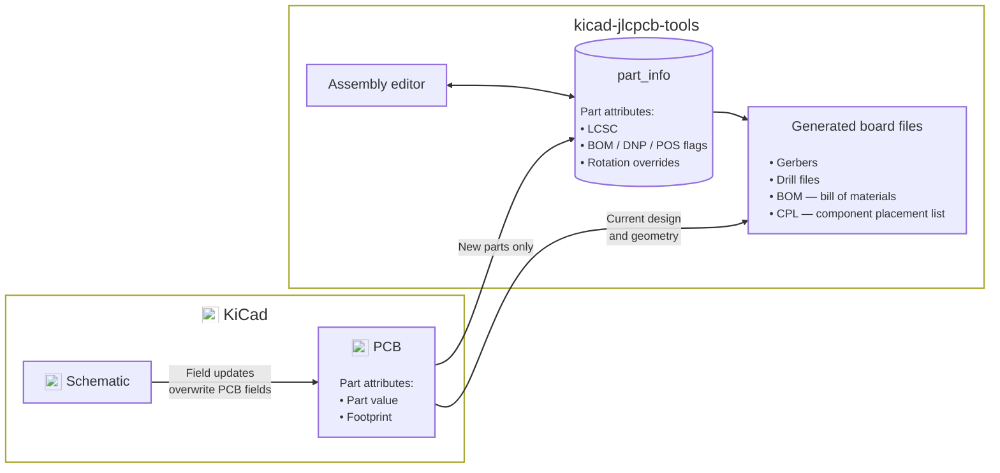
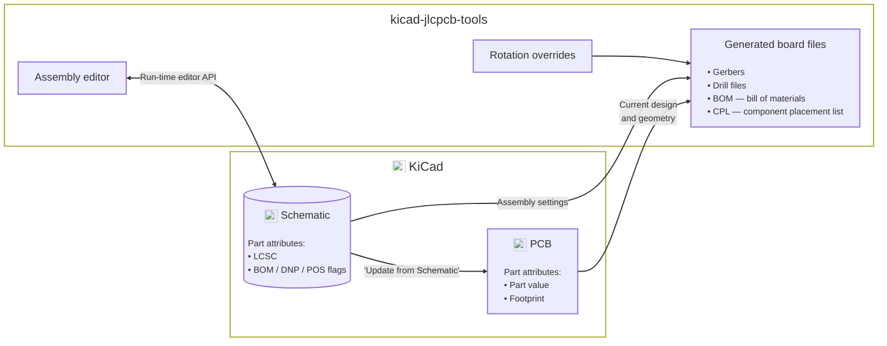

#  KiCAD JLCPCB tools

<a href="https://ko-fi.com/I3I364QTM" target="_blank"></a> <a href="https://www.buymeacoffee.com/bouni" target="_blank"></a> <a href="https://github.com/sponsors/Bouni" target="_blank"></a>

***

   

***

[](https://github.com/Bouni/kicad-jlcpcb-tools/actions/workflows/update_parts_database.yml)

***

Plugin to generate all files necessary for JLCPCB board fabrication and assembly

- Gerber files
- Excellon files
- BOM file
- CPL file

Search the JLCPCB catalog and assign manufacturing parts to your board's footprints in the plugin database.


## Installation 💾

### KiCAD PCM

Add my custom repo to *the Plugin and Content Manager*, the URL is:

```sh
https://raw.githubusercontent.com/Bouni/bouni-kicad-repository/main/repository.json
```


From there you can install the plugin via the GUI.

### Git

Simply clone this repo into your `scripting/plugins` folder.

**Windows**

```sh
cd C:\users\<username>\Documents\kicad\<version>\scripting\plugins\  # <username> is your username, <version> can be 7.0, 8.0, or X.YY depending on the version you use
git clone https://github.com/Bouni/kicad-jlcpcb-tools.git
```

**Linux**

```sh
cd /home/<username>/.local/share/kicad/<version>/scripting/plugins  # <version> can be 7.0, 8.0, or X.YY depending on the version you use
git clone https://github.com/Bouni/kicad-jlcpcb-tools.git
```

**MacOS**

```sh
cd ~/Library/Preferences/kicad/scripting/plugins
git clone https://github.com/Bouni/kicad-jlcpcb-tools.git
```

You may need to create the `scripting/plugins` folder if it does not exist.

### Flatpak :warning:

The Flatpak installation of KiCAD currently does not ship with pip and requests installed. The later is required for the plugin to work.
In order to get it working you can run the following 3 commands:

1. `flatpak run --command=sh org.kicad.KiCad`
2. `python -m ensurepip --upgrade`
3. `/var/data/python/bin/pip3 install requests`

See [issue #94](https://github.com/Bouni/kicad-jlcpcb-tools/issues/94) for more info.

## Usage 🥳

To access the plugin choose `Tools → External Plugins → JLCPCB Tools` from the *PCB Editor* menus

Checkout this screencast, it shows quickly how to use this plugin:


## Data flow and ownership

### History

Historically this plugin had an inconsistent data flow. This is due to the fact that KiCAD, even v10, doesn't permit the plugin to bi-directionally edit schematics at run-time.

Risks to the consistency of your design when using Kicad design files as the source of JLCPCB truth:

- PCB BOM, POS, and DNP attributes are updated each time you click on 'Update from schematic' in the PCB editor. If a custom LCSC field is present in the schematic part this field will also be updated.

- As of Kicad v10 there is no mechanism for the plugin to interact with the schematic at run-time. Previously the plugin could write directly to schematic files via the 'Export to schematic' option. However a workflow that flows data through the schematic has a few conditions that have to be met:

  - The schematic file format doesn't change (a relatively safe assumption) but it's still not a good idea for a plugin to be overwriting or editing a schematic file directly.
  - The user isn't editing the schematic at the same time as the schematic file is being overwritten (not a safe assumption). Saving an open schematic editor's stale copy can overwrite changes made directly to the file by the plugin.
  - The 'Export to schematic' feature must be used consistently to keep the plugin and schematic in sync—an unreliable assumption for a manual step.

- The plugin did not always update its internal part mapping of LCSC, BOM, DNP, and POS values from the board file due to the challenges in ensuring that the kicad design, in particular the schematic, could be used to hold the state of these fields when they are altered from the plugin. This means we can potentially have two sources of truth.

This puts the plugin in a tough position. It *wants to be able to use Kicad as the sole source of truth and data* but Kicad doesn't provide a mechanism by which to do that.

If we can't use Kicad as the sole source of truth we've decided to go the other direction and shift away from storing any jlcpcb specific data in board design files. This involved removing parts of this workflow that can result in inconsistent data and cause confusion. In particular we've decided:

- 'Export to schematic' isn't safe enough to be performed automatically.

- So we've removed the 'Export to schematic' button / feature.
  - If not automatic then the onus is on the user to understand when to use it. We shouldn't put the onus on the user to always do the right thing as it can cause confusion, frustration, and potentially incorrect designs being generated.

- To avoid two conflicting sources of truth we should *only* use the plugin's settings as the source of truth.

- So we've stopped writing LCSC / BOM / DNP / POS updates to the pcb board file.
  - Without a consistent ability to update schematic if you've ever used the 'Export to schematic' feature the next time you hit 'Update from schematic' the board part fields will be overwritten by the schematic part fields and you'll at minimum risk having incorrect LCSC values in the board file.
  - If you modified BOM / POS / DNP fields those will be out of sync as well. PCB fields initialize parts without an existing plugin record, but never overwrite saved LCSC, BOM, POS, or DNP choices.

### Future

When a new KiCAD vesion adds support for bi-diretional live schematic editing we'll modify the plugin to use and prefer this path as the single source of truth.

### Present data flow



### Future data flow



[KiCad application icons](https://github.com/KiCad/kicad-source-mirror/tree/10.0.0/resources/linux/icons/hicolor/scalable/apps) © KiCad contributors, licensed under [CC BY-SA 4.0](https://creativecommons.org/licenses/by-sa/4.0/).

| Data used for manufacturing | Present owner | Future owner |
| --- | --- | --- |
| LCSC part assignment | Plugin - `part_info` table | KiCad Design |
| Include/exclude from BOM | Plugin - `part_info` table | KiCad Design |
| Include/exclude from placement files (POS) | Plugin - `part_info` table | KiCad Design |
| Do not populate (DNP) | Plugin - `part_info` table | KiCad Design |
| Reference, value, and footprint | KiCad Design | Same |
| Position, rotation, board side and pads | KiCad Design | Same |
| JLCPCB Placement and rotation corrections | Plugin - Corrections Manager | Same |
| JLCPCB assembly classification | Plugin - Supplier, cached in the global plugin database | Same |
| JLCPCB stock, prices and descriptions | Plugin - Supplier catalog | Same |

## Keyboard shortcuts

Windows can be closed with ctrl-w/ctrl-q/command-w/command-w (OS dependent) and escape.
Pressing enter in the keyword text box will start a search.

### Toggle BOM / CPL / DNP choices

Toggle `exclude from BOM`, `exclude from CPL`, or `DNP` for selected parts in the plugin. These choices affect generated files and do not modify the PCB's native settings.

### Select LCSC parts from the JLCPCB parts database

Select one or multiple footprints, click select part. You can select parts with equal value and footprint using the Select alike button.
In the upcoming modal dialog, search for parts, select the one of your choice and click select part.
The selected LCSC number is saved immediately in `jlcpcb/project.db`, associated with the board and each footprint's UUID. Keep this database with your project. Moving the whole project preserves assignments; a renamed or copied board path starts a separate set of choices.


### Part preferences

Part preferences remember which LCSC part to use for a value and footprint combination across projects. Two independent settings are enabled by default:

- **Remember my part preferences** remembers each successful part selection or pasted LCSC assignment. The latest explicit assignment replaces the preference; opening a board does not change preferences.
- **Part preferences fill empty LCSC assignments for new parts** fills eligible blanks only when parts are first imported into the plugin database. Existing records are preserved. DNP parts and parts excluded from BOM or POS are skipped.

Clearing an LCSC assignment keeps its reusable preference, but the part stays blank after reopening. The right-click actions **Save part preferences** and **Apply part preferences** remain available even when automation is disabled. Use **Part preferences** to delete, import, or export preferences. Deleting a preference does not remove existing project assignments.

### Generate fabrication data

Generate all necessary assembly files for your board with a simple click.

A new directory called `jlcpcb` is created, and in there, two separate folders are created, `gerber` and `production_files`.

In the gerber folder all necessary `*.gbr` and `*.drl` files are generated and zipped into the `production_files` folder, ready for upload to JLCPCB.
The zipfile is named `GERBER-<projectname>.zip`

Also in the `production_files` folder, two files are generated, `BOM-<projectname>.csv` and `CPL-<projectname>.csv`.

Parts are included in BOM and CPL files according to the plugin's BOM/POS choices; DNP parts are excluded from both. PCB geometry supplies their current positions and orientations.

Optional pre/post generation hook scripts can be configured in settings.

- The pre-hook runs before generation and can block generation on failure (with Continue/Cancel prompt).
- The post-hook runs only after successful generation.

See [HOOKS.md](HOOKS.md) for configuration details and available environment variables.


### Export Additional JLC Specific Layers

Some boards you have manufactured will require additional layers in your Gerber. For example, when manufacturing flex PCBs with a stiffener, JLC requires a layer outlining the stiffener layer (top/bottom), dimensions and the stiffener material properties (material, thickness etc). Export these additional JLC specific layers in your production files with a simple modification.

Additional layers can be exported by creating layers with `JLC_` as the prefix of the layer name. You can access and edit the layer names in *Board Setup/Board Stackup/Board Editor Layers*

This tool will automatically export all additional layers with the JLC_ prefix and add them to the production files in `GERBER-<projectname>.zip`


## Footprint rotation correction

JLCPCB seems to need corrected rotation information. @matthewlai implemented that in his [JLCKicadTools](https://github.com/matthewlai/JLCKicadTools) and I adopted his work in this plugin as well.
You can download Matthews file from GitHub and manage your own corrections in the Rotation manager.

See [Importing and repairing corrections](CORRECTIONS.md) for supported CSV
formats, validation rules, and recovery of invalid records from older versions.

## Icons

This plugin makes use of a lot of icons from the excellent [Material Design Icons](https://materialdesignicons.com/)

## Development

1. Fork repo
2. Git clone forked repo
3. Install pre-commit `pip install pre-commit`
4. Setup pre-commit `pre-commit run`
5. Create feature branch `git switch -c my-awesome-feature`
6. Make your changes
7. Commit your changes `git commit -m "Awesome new feature"`
8. Push to GitHub `git push`
9. Create PR

Make sure you make use of pre-commit hooks in order to format everything nicely with `black`
In the near future I'll add `ruff` / `pylint` and possibly other pre-commit-hooks that enforce nice and clean code style.

### Settings

`default_settings.json` holds the settings a fresh install starts from and is the only
settings file tracked in git. The plugin writes the settings you actually use to
`settings.json` beside it, which is git-ignored, so toggling a checkbox while developing
no longer shows up as a change to commit.

On every launch the stored settings are layered over the defaults, so a setting added by
a newer version arrives with its default rather than being missing. Add new settings to
`default_settings.json`; `tests/test_settings_defaults.py` fails if a setting the code
reads has no default shipped for it.

## How to rebuild the parts database

The parts database is rebuilt by the [update_parts_database.yml GitHub workflow](https://github.com/Bouni/kicad-jlcpcb-tools/blob/main/.github/workflows/update_parts_database.yml)

You can reference the steps in the 'Update database' section for the commands to run locally.

## python libraries

lib/ contains the necessary python packages that may not be a part of the KiCad python distribution.

These packages include:

- packaging

To install a package, such as 'packaging':

```python
pip install packaging --target ./lib
```

To update these packages:

```python
pip install packaging --upgrade --target ./lib
```

Future versions of KiCad may have support for a requires.txt to automate this process.

## Standalone mode

Allows the plugin UI to be started without KiCAD, enabling debugging with an IDE like pycharm / vscode.

Standalone mode is under development.

### Limitations

- All board / footprint / value data are hardcoded stubs, see standalone_impl.py

### How to use

To use the plugin in standlone mode you'll need to identify three pieces of information specific to your Kicad version, plugin path, and OS.

#### Python

The <i><b>{KiCad python}</b></i> should be used, this can be found at different locations depending on your system:

| OS     | Kicad python                                                                                |
|--------|---------------------------------------------------------------------------------------------|
|Mac     | /Applications/KiCad/KiCad.app/Contents/Frameworks/Python.framework/Versions/3.9/bin/python3 |
|Linux   | /usr/bin/python3                                                                            |
|Windows | C:\Program Files\KiCad\8.0\bin\python.exe                                                   |

#### Working directory

The <i><b>{working directory}</b></i> should be your plugins directory, ie:

| OS     | Working dir                                                |
|--------|------------------------------------------------------------|
|Mac     | ~/Documents/KiCad/<version>/scripting/plugins/             |
|Linux   | ~/.local/share/kicad/<version>/scripting/plugins/          |
|Windows | %USERPROFILE%\Documents\KiCad\<version>\scripting\plugins\ |

> [!NOTE]  
> <version> can be 7.0, 8.0, or X.YY depending on the version you use

#### Plugin folder name

The <i><b>{kicad-jlcpcb-tools folder name}</b></i> should be the name of the kicad-jlcpcb-tools folder.

- For Kicad managed plugins this may be like

> com_github_bouni_kicad-jlcpcb-tools

- If you are developing kicad-jlcpcb-tools this is the folder you cloned the kicad-jlcpcb-tools as.

#### Command line

- Change to the working directory as noted above
- Run the python interpreter with the <i><b>{kicad-jlcpcb-tools folder name}</b></i> folder as a module.

For example:

```sh
cd {working directory}
{kicad_python} -m {kicad-jlcpcb-tools folder name}
```

For example on Mac:

```sh
/Applications/KiCad/KiCad.app/Contents/Frameworks/Python.framework/Versions/3.9/bin/python3 -m kicad-jlcpcb-tools
```

For example on Linux:

```sh
cd ~/.local/share/kicad/8.0/scripting/plugins/ && python -m kicad-jlcpcb-tools
```

For example on Windows:

```cmd
& 'C:\Program Files\KiCad\8.0\bin\python.exe' -m kicad-jlcpcb-tools
```

#### IDE

- Configure the command line to be '{kicad_python} -m {kicad-jlcpcb-tools folder name}'
- Set the working directory to {working directory}

If using PyCharm or Jetbrains IDEs, set the interpreter to Kicad's python, <i><b>{Kicad python}</b></i> and under 'run configuration' select Python.

Click on 'script path' and change instead to 'module name',
entering the name of the kicad-jlcpcb-tools folder, <i><b>{kicad-jlcpcb-tools folder name}</b></i>.

## How to release new versions of this plugin

[bouni-kicad-repository](https://raw.githubusercontent.com/Bouni/bouni-kicad-repository/main/repository.json) contains the
files for the latest version of the plugin, in the format KiCAD expects from external plugins.

To release a new version of this plugin:

1. In the <b>kicad-jlcpcb-plugin</b> repository:
   1. Visit the releases page 
   1. Click on 'Choose a tag', enter the next release number, say 2025.04.01 for example, and click on 'Create Tag' 
   1. Click 'Generate release notes' 
   1. If the release notes looks good, click on 'Publish release' 
1. Automatically the new release will trigger the 'kicad-pcm' workflow which will:
   1. Pull the latest plugin tag
   1. Create the appropriate pcm archive
   1. Upload the zip as an asset to a new GitHub release
   1. benc-uk/workflow-dispatch@v1 is used to trigger the 'Rebuild repository' workflow in [bouni-kicad-repository](https://github.com/Bouni/bouni-kicad-repository)
1. Automatically in the <b>bouni-kicad-repository</b>, the 'Rebuild repository' (rebuild.yml) workflow runs 'generate.py'
   1. generate.py updates .json and the latest .zip file using the release assets from the kicad-jlcpcb-plugin repository
1. The plugin should now be visible to users via the plugin manager.
