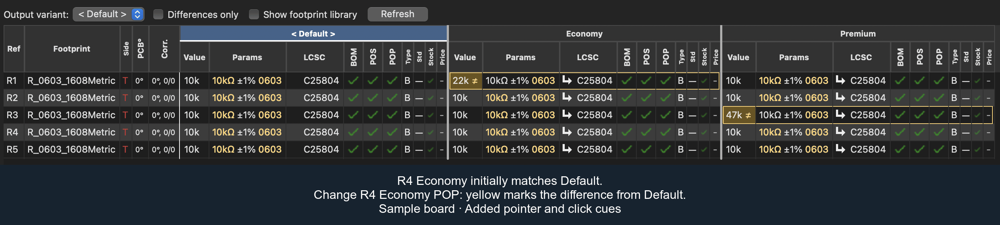
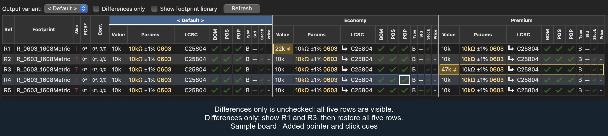
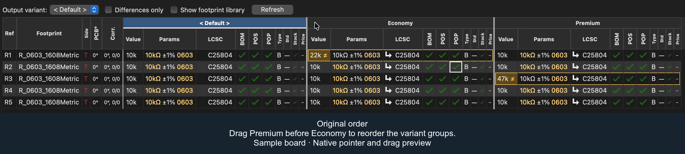

#  KiCAD JLCPCB tools

<a href="https://ko-fi.com/I3I364QTM" target="_blank"></a> <a href="https://www.buymeacoffee.com/bouni" target="_blank"></a> <a href="https://github.com/sponsors/Bouni" target="_blank"></a>

***

   

***

[](https://github.com/Bouni/kicad-jlcpcb-tools/actions/workflows/update_parts_database.yml)

***

Plugin to generate all files necessary for JLCPCB board fabrication and assembly

- Gerber files
- Excellon files
- BOM file
- CPL file

Furthermore it lets you search the JLCPCB parts database and assign parts directly to the footprints which result in them being put into the BOM file.

On KiCad 10 boards with named [design variants](#design-variants-kicad-10),
compare and edit variants side by side and generate separate fabrication outputs.


## Installation 💾

### KiCAD PCM

Add my custom repo to *the Plugin and Content Manager*, the URL is:

```sh
https://raw.githubusercontent.com/Bouni/bouni-kicad-repository/main/repository.json
```


From there you can install the plugin via the GUI.

### Git

Clone this repo into your KiCad `scripting/plugins` folder.

> [!TIP]
> You can open the plugins directory directly from KiCad to avoid locating the path manually:
> In the *PCB Editor*, choose **Tools → External Plugins → Open Plugin Directory** (or **Reveal Plugin Folder in Finder** on macOS), or open **Preferences → PCB Editor → Action Plugins** and click the folder icon. From that directory, open a terminal and run `git clone https://github.com/Bouni/kicad-jlcpcb-tools.git`.

Alternatively, navigate to the folder in your terminal:

**Windows (Command Prompt)**

```cmd
cd "%USERPROFILE%\Documents\KiCad\<version>\scripting\plugins"
git clone https://github.com/Bouni/kicad-jlcpcb-tools.git
```

**Windows (PowerShell)**

```powershell
cd "$HOME\Documents\KiCad\<version>\scripting\plugins"
git clone https://github.com/Bouni/kicad-jlcpcb-tools.git
```

**Linux**

```sh
cd ~/.local/share/kicad/<version>/scripting/plugins
git clone https://github.com/Bouni/kicad-jlcpcb-tools.git
```

**macOS**

```sh
cd ~/Documents/KiCad/<version>/scripting/plugins
git clone https://github.com/Bouni/kicad-jlcpcb-tools.git
```

> [!NOTE]
> `<version>` can be `7.0`, `8.0`, `9.0`, or `X.YY` depending on the version you use. You may need to create the `scripting/plugins` folder if it does not exist.

After cloning, choose **Tools → External Plugins → Refresh Plugins** in the *PCB Editor* (or restart KiCad) to load the plugin.

### Flatpak :warning:

The Flatpak installation of KiCAD currently does not ship with pip and requests installed. The later is required for the plugin to work.
In order to get it working you can run the following 3 commands:

1. `flatpak run --command=sh org.kicad.KiCad`
2. `python -m ensurepip --upgrade`
3. `/var/data/python/bin/pip3 install requests`

See [issue #94](https://github.com/Bouni/kicad-jlcpcb-tools/issues/94) for more info.

## Usage 🥳

To access the plugin choose `Tools → External Plugins → JLCPCB Tools` from the *PCB Editor* menus

Checkout this screencast, it shows quickly how to use this plugin:


### Design variants (KiCad 10+)

Create named variants in KiCad and transfer them to the PCB to use the variant
table. Boards without named variants keep the ordinary parts table.

- **Compare variants side by side**, with Ref, Footprint, Side, PCB angle, and Correction columns fixed on the left when space permits. Ref stays fixed in narrower windows.
- **Spot differences quickly** through highlighted settings and yellow outlines around the affected variant’s cells in each component row.
- **Focus on differing component settings** with **Differences only** in the toolbar above the table.
- **Edit each variant independently:** Value, LCSC assignment, and BOM/POS/POP (populated) flags. Select components within one variant for batch assignments, flag changes, and copying.
- **Copy and paste selected components between variants:** Copy transfers Value, LCSC and BOM/POS/POP settings for every selected component; select the same components in another variant and Paste. Use **Copy cell value** for an individual value, or **Copy to variants…** to choose fields and destination variants.
- **Drag variant headers to reorder them** and bring variants together for comparison.
- **Compare price and stock availability** using compact indicators and hover details.
- **Choose an Output variant** to generate its BOM, placement, and fabrication files.
- **Review placement corrections for the Output variant** in the Correction column. Exact LCSC rules follow that variant's assigned part; pattern rules use Default's reference, Value, and placed footprint.

Assignments and flags are stored in the KiCad board; save the PCB to preserve edits.

The examples below use sample component data in the main JLCPCB Tools
window. Pointer and click cues make the actions easier to follow.

#### Edit settings and see differences

Change a setting in one variant to compare it with **Default**. Here,
turning off **POP** (populated) for **R4** in **Economy** highlights the
changed cell and outlines Economy’s cells in that row. The yellow outline
remains visible while the row is selected.

Turn POP back on to match Default and clear R4’s difference highlight.



#### Show differences only

Select **Differences only** in the toolbar above the table to focus on
differing component settings. In this example, enabling the checkbox
leaves **R1** and **R3** visible. Clear it to bring all five rows back.



#### Reorder variant columns

Drag a variant header to move its entire group of columns. Here,
**Premium** moves before **Economy**.

The translucent column preview follows the pointer, while the insertion
marker and **Drop before Economy** label show the destination. Release the
header to change the order to **Default**, **Premium**, **Economy**.



## Keyboard shortcuts

Windows can be closed with ctrl-w/ctrl-q/command-w/command-w (OS dependent) and escape.
Pressing enter in the keyword text box will start a search.

### Toggle BOM / CPL attributes

You can easily toggle the `exclude from BOM` and `exclude from CPL` attributes of one or multiple footprints.

### Select LCSC parts from the JLCPCB parts database

Select one or multiple footprints, click select part. You can select parts with equal value and footprint using the Select alike button.
In the upcoming modal dialog, search for parts, select the one of your choice and click select part.
The LCSC number of your selection will then be assigned to the footprints.


To type or paste an LCSC number instead, right-click the selected footprints and choose **Enter LCSC…**. It accepts a part number such as `C25804` or a product link copied from lcsc.com or jlcpcb.com. The number may be one the downloaded parts library does not list: JLC can still assemble LCSC-only parts it buys in through pre-order or global sourcing, and your library may be older than the part. The plugin asks once before assigning such a number. With no library downloaded there is nothing to check against, so it assigns without asking.

### Part preferences

Part preferences remember which LCSC part to use for a value and footprint combination across projects. Two independent settings are enabled by default:

- **Remember my part preferences** remembers each successful part selection or pasted LCSC assignment. The latest explicit assignment replaces the preference; opening a board does not change preferences.
- **Parts preferences fill in empty LCSC assignments** fills blank LCSC assignments once each time the plugin window opens. Existing assignments are preserved. DNP parts and parts excluded from BOM or POS are skipped.

Clearing an LCSC assignment keeps its part preference, so an eligible blank assignment may fill again on the next opening. Exclude the part or disable automatic filling to keep it blank. The right-click actions **Save part preferences** and **Apply part preferences** remain available even when automation is disabled. Use **Part preferences** to delete, import, or export preferences. Deleting a preference does not remove assignments from your boards.

### Generate fabrication data

Generate all necessary assembly files for your board with a simple click.

A new directory called `jlcpcb` is created, and in there, two separate folders are created, `gerber` and `production_files`.

In the gerber folder all necessary `*.gbr` and `*.drl` files are generated and zipped into the `production_files` folder, ready for upload to JLCPCB.
The zipfile is named `GERBER-<projectname>.zip`

Also in the `production_files` folder, two files are generated, `BOM-<projectname>.csv` and `CPL-<projectname>.csv`.

Footprints are included into the BOM and CPL files according to their `exclude from BOM` and `exclude from POS` attributes.

Optional pre/post generation hook scripts can be configured in settings.

- The pre-hook runs before generation and can block generation on failure (with Continue/Cancel prompt).
- The post-hook runs only after successful generation.

See [HOOKS.md](HOOKS.md) for configuration details and available environment variables.


### Export Additional JLC Specific Layers

Some boards you have manufactured will require additional layers in your Gerber. For example, when manufacturing flex PCBs with a stiffener, JLC requires a layer outlining the stiffener layer (top/bottom), dimensions and the stiffener material properties (material, thickness etc). Export these additional JLC specific layers in your production files with a simple modification.

Additional layers can be exported by creating layers with `JLC_` as the prefix of the layer name. You can access and edit the layer names in *Board Setup/Board Stackup/Board Editor Layers*

This tool will automatically export all additional layers with the JLC_ prefix and add them to the production files in `GERBER-<projectname>.zip`


## Footprint rotation correction

JLCPCB seems to need corrected rotation information. @matthewlai implemented that in his [JLCKicadTools](https://github.com/matthewlai/JLCKicadTools) and I adopted his work in this plugin as well.
You can download Matthews file from GitHub and manage your own corrections in the Rotation manager.

See [Importing and repairing corrections](CORRECTIONS.md) for supported CSV
formats, validation rules, and recovery of invalid records from older versions.

## Icons

This plugin makes use of a lot of icons from the excellent [Material Design Icons](https://materialdesignicons.com/)

## Development

1. Fork repo
2. Git clone forked repo
3. Install pre-commit `pip install pre-commit`
4. Setup pre-commit `pre-commit run`
5. Create feature branch `git switch -c my-awesome-feature`
6. Make your changes
7. Commit your changes `git commit -m "Awesome new feature"`
8. Push to GitHub `git push`
9. Create PR

Make sure you make use of pre-commit hooks in order to format everything nicely with `black`
In the near future I'll add `ruff` / `pylint` and possibly other pre-commit-hooks that enforce nice and clean code style.

### Tests

Report ordinary Python tests, real wx controls, and real KiCad tests separately.
A passing test that uses a fake board does not verify KiCad's file handling,
project state, or native object cleanup.

```sh
python -m pytest -rs -m 'not native_wx and not native_kicad'
python -m pytest -rs --require-native=wx -m 'not native_kicad and not os_input'
python -m pytest -rs --require-native=wx -m os_input
python -m pytest -rs --require-native=kicad -m native_kicad
```

The required native modes reject missing libraries, empty native selections, and
skipped native tests. Run them with Python libraries matching the installed KiCad
or wx packages. Mouse/keyboard tests require an isolated desktop with a window
manager; Linux native tests can use Xvfb.

To reproduce CI locally, use an Ubuntu 24.04 Docker container with the same CPU
architecture, KiCad packages, dependencies, and commands as
[the test workflow](.github/workflows/tests.yml). Copy the tracked source tree so
untracked test files cannot change collection. Include the tested revision,
Python/wx/KiCad versions, command, and pass/skip/deselection counts when reporting
results. A required lane that was not run remains unvalidated.

### Settings

`default_settings.json` holds the settings a fresh install starts from and is the only
settings file tracked in git. The plugin writes the settings you actually use to
`settings.json` beside it, which is git-ignored, so toggling a checkbox while developing
no longer shows up as a change to commit.

On every launch the stored settings are layered over the defaults, so a setting added by
a newer version arrives with its default rather than being missing. Add new settings to
`default_settings.json`; `tests/test_settings_defaults.py` fails if a setting the code
reads has no default shipped for it.

## How to rebuild the parts database

The parts database is rebuilt by the [update_parts_database.yml GitHub workflow](https://github.com/Bouni/kicad-jlcpcb-tools/blob/main/.github/workflows/update_parts_database.yml)

You can reference the steps in the 'Update database' section for the commands to run locally.

## python libraries

lib/ contains the necessary python packages that may not be a part of the KiCad python distribution.

These packages include:

- packaging

To install a package, such as 'packaging':

```python
pip install packaging --target ./lib
```

To update these packages:

```python
pip install packaging --upgrade --target ./lib
```

Future versions of KiCad may have support for a requires.txt to automate this process.

## Standalone mode

Allows the plugin UI to be started without KiCAD, enabling debugging with an IDE like pycharm / vscode.

Standalone mode is under development.

### Limitations

- All board / footprint / value data are hardcoded stubs, see standalone_impl.py

### How to use

To use the plugin in standlone mode you'll need to identify three pieces of information specific to your Kicad version, plugin path, and OS.

#### Python

The <i><b>{KiCad python}</b></i> should be used, this can be found at different locations depending on your system:

| OS     | Kicad python                                                                                |
|--------|---------------------------------------------------------------------------------------------|
|Mac     | /Applications/KiCad/KiCad.app/Contents/Frameworks/Python.framework/Versions/3.9/bin/python3 |
|Linux   | /usr/bin/python3                                                                            |
|Windows | C:\Program Files\KiCad\8.0\bin\python.exe                                                   |

#### Working directory

The <i><b>{working directory}</b></i> should be your plugins directory, ie:

| OS     | Working dir                                                |
|--------|------------------------------------------------------------|
|Mac     | ~/Documents/KiCad/<version>/scripting/plugins/             |
|Linux   | ~/.local/share/kicad/<version>/scripting/plugins/          |
|Windows | %USERPROFILE%\Documents\KiCad\<version>\scripting\plugins\ |

> [!NOTE]  
> <version> can be 7.0, 8.0, 9.0, or X.YY depending on the version you use

#### Plugin folder name

The <i><b>{kicad-jlcpcb-tools folder name}</b></i> should be the name of the kicad-jlcpcb-tools folder.

- For Kicad managed plugins this may be like

> com_github_bouni_kicad-jlcpcb-tools

- If you are developing kicad-jlcpcb-tools this is the folder you cloned the kicad-jlcpcb-tools as.

#### Command line

- Change to the working directory as noted above
- Run the python interpreter with the <i><b>{kicad-jlcpcb-tools folder name}</b></i> folder as a module.

For example:

```sh
cd {working directory}
{kicad_python} -m {kicad-jlcpcb-tools folder name}
```

For example on Mac:

```sh
/Applications/KiCad/KiCad.app/Contents/Frameworks/Python.framework/Versions/3.9/bin/python3 -m kicad-jlcpcb-tools
```

For example on Linux:

```sh
cd ~/.local/share/kicad/8.0/scripting/plugins/ && python -m kicad-jlcpcb-tools
```

For example on Windows:

```cmd
& 'C:\Program Files\KiCad\8.0\bin\python.exe' -m kicad-jlcpcb-tools
```

#### IDE

- Configure the command line to be '{kicad_python} -m {kicad-jlcpcb-tools folder name}'
- Set the working directory to {working directory}

If using PyCharm or Jetbrains IDEs, set the interpreter to Kicad's python, <i><b>{Kicad python}</b></i> and under 'run configuration' select Python.

Click on 'script path' and change instead to 'module name',
entering the name of the kicad-jlcpcb-tools folder, <i><b>{kicad-jlcpcb-tools folder name}</b></i>.

## How to release new versions of this plugin

[bouni-kicad-repository](https://raw.githubusercontent.com/Bouni/bouni-kicad-repository/main/repository.json) contains the
files for the latest version of the plugin, in the format KiCAD expects from external plugins.

To release a new version of this plugin:

1. In the <b>kicad-jlcpcb-plugin</b> repository:
   1. Visit the releases page 
   1. Click on 'Choose a tag', enter the next release number, say 2025.04.01 for example, and click on 'Create Tag' 
   1. Click 'Generate release notes' 
   1. If the release notes looks good, click on 'Publish release' 
1. Automatically the new release will trigger the 'kicad-pcm' workflow which will:
   1. Pull the latest plugin tag
   1. Create the appropriate pcm archive
   1. Upload the zip as an asset to a new GitHub release
   1. benc-uk/workflow-dispatch@v1 is used to trigger the 'Rebuild repository' workflow in [bouni-kicad-repository](https://github.com/Bouni/bouni-kicad-repository)
1. Automatically in the <b>bouni-kicad-repository</b>, the 'Rebuild repository' (rebuild.yml) workflow runs 'generate.py'
   1. generate.py updates .json and the latest .zip file using the release assets from the kicad-jlcpcb-plugin repository
1. The plugin should now be visible to users via the plugin manager.
